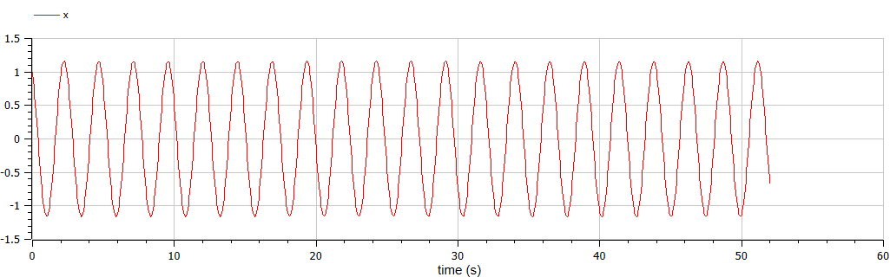

---
# Front matter
lang: ru-RU  
title: "Отчёт по лабораторной работе №4"
subtitle: "дисциплина: Математическое моделирование"  
author: "Пономарева Лилия Михайловна"  

# Generic options
lang: ru-RU
toc-title: "Содержание"

# Bibliography
bibliography: bib/cite.bib
csl: pandoc/csl/gost-r-7-0-5-2008-numeric.csl

# Pdf output format
toc: true # Table of contents
toc_depth: 2
lof: true # List of figures
lot: true # List of tables
fontsize: 12pt
linestretch: 1.5
papersize: a4paper
documentclass: scrreprt
## I18n
polyglossia-lang:
  name: russian
  options:
  - spelling=modern
  - babelshorthands=true
polyglossia-otherlangs:
  name: english
### Fonts
mainfont: PT Serif
romanfont: PT Serif
sansfont: PT Sans
monofont: PT Mono
mainfontoptions: Ligatures=TeX
romanfontoptions: Ligatures=TeX
sansfontoptions: Ligatures=TeX,Scale=MatchLowercase
monofontoptions: Scale=MatchLowercase,Scale=0.9
## Biblatex
biblatex: true
biblio-style: "gost-numeric"
biblatexoptions:
  - parentracker=true
  - backend=biber
  - hyperref=auto
  - language=auto
  - autolang=other*
  - citestyle=gost-numeric
## Misc options
indent: true
header-includes:
  - \linepenalty=10 # the penalty added to the badness of each line within a paragraph (no associated penalty node) Increasing the value makes tex try to have fewer lines in the paragraph.
  - \interlinepenalty=0 # value of the penalty (node) added after each line of a paragraph.
  - \hyphenpenalty=50 # the penalty for line breaking at an automatically inserted hyphen
  - \exhyphenpenalty=50 # the penalty for line breaking at an explicit hyphen
  - \binoppenalty=700 # the penalty for breaking a line at a binary operator
  - \relpenalty=500 # the penalty for breaking a line at a relation
  - \clubpenalty=150 # extra penalty for breaking after first line of a paragraph
  - \widowpenalty=150 # extra penalty for breaking before last line of a paragraph
  - \displaywidowpenalty=50 # extra penalty for breaking before last line before a display math
  - \brokenpenalty=100 # extra penalty for page breaking after a hyphenated line
  - \predisplaypenalty=10000 # penalty for breaking before a display
  - \postdisplaypenalty=0 # penalty for breaking after a display
  - \floatingpenalty = 20000 # penalty for splitting an insertion (can only be split footnote in standard LaTeX)
  - \raggedbottom # or \flushbottom
  - \usepackage{float} # keep figures where there are in the text
  - \floatplacement{figure}{H} # keep figures where there are in the text
---

# Цель работы

Рассмотреть построение фазового портрета и решения уравнения гармонического осциллятора.


# Теоретическое введение

Движение грузика на пружинке, маятника, заряда в электрическом контуре, а также эволюция во времени многих систем в физике, химии, биологии и других науках при определенных предположениях можно описать одним и тем же дифференциальным уравнением, которое в теории колебаний выступает в качестве основной модели. Эта модель называется линейным гармоническим осциллятором.
Уравнение свободных колебаний гармонического осциллятора имеет следующий вид:
$$\ddot{x}+2\gamma\dot{x}+\omega_0^2=0$$

где $x$ - переменная, описывающая состояние системы (смещение грузика, заряд конденсатора и т.д.), $\gamma$ - параметр, характеризующий потери энергии (трение в механической системе, сопротивление в контуре), $\omega_0$ - собственная частота колебаний.
Это уравнение есть линейное однородное дифференциальное  уравнение второго порядка и оно является примером линейной динамической системы.

При отсутствии потерь в системе ( $\gamma=0$ ) получаем уравнение консервативного осциллятора энергия колебания которого сохраняется во времени.
$$\ddot{x}+\omega_0^2x=0$$

Для однозначной разрешимости уравнения второго порядка необходимо задать два начальных условия вида
 
$$
 \begin{cases}
	x(t_0)=x_0
	\\   
	\dot{x(t_0)}=y_0
 \end{cases}
$$

Уравнение второго порядка можно представить в виде системы двух уравнений первого порядка:
$$
 \begin{cases}
	x=y
	\\   
	y=-\omega_0^2x
 \end{cases}
$$

Начальные условия для системы примут вид:
$$
 \begin{cases}
	x(t_0)=x_0
	\\   
	y(t_0)=y_0
 \end{cases}
$$

Независимые переменные $x, y$ определяют пространство, в котором «движется» решение. Это фазовое пространство системы, поскольку оно двумерно будем называть его фазовой плоскостью.
Значение фазовых координат $x, y$ в любой момент времени полностью определяет состояние системы. Решению уравнения движения как функции времени отвечает гладкая кривая в фазовой плоскости. Она называется фазовой траекторией. Если множество различных решений (соответствующих различным начальным условиям) изобразить на одной фазовой плоскости, возникает общая картина поведения системы. Такую картину, образованную набором фазовых траекторий, называют фазовым портретом.

# Задание

[Вариант 44]

Постройте фазовый портрет гармонического осциллятора и решение уравнения гармонического осциллятора для следующих случаев 

1. Колебания гармонического осциллятора без затуханий и без действий внешней
силы $\ddot{x}+6.6x=0$
2. Колебания гармонического осциллятора c затуханием и без действий внешней
силы $\ddot{x}+9\dot{x}+2x=0$
3. Колебания гармонического осциллятора c затуханием и под действием внешней
силы $\ddot{x}+2.4\dot{x}+6x=0.2\cos{3t}$

На интервале $t \in [0;52]$, шаг 0.05, $x_0=1, y_0=-1.5$


# Ход работы

### 1 случай
Уравнение $$\ddot{x}+6.6x=0$$
Это уравнение второго порядка представим в виде системы двух уравнений первого порядка:
$$
 \begin{cases}
	\dot{x}=y
	\\   
	\dot{y}=-6.6x
 \end{cases}
$$

Перейдем к построению решения уравнения и фазового портрета гармонических колебаний.

**Код Modelica**  
```
model lab04_1
  parameter Real w = 6.6;
  Real x(start=1);
  Real y(start=-1.5);
  
equation
    der(x)= y;
    der(y)= -w*x;

  annotation(experiment(StartTime=0, StopTime=52, Tplerance=1e06, Interval=0.05));
end lab04_1;
```

**Полученные графики**  
 
{ #fig:001 width=70% height=70% }


{ #fig:002 width=70% height=70% }

**Вывод по 1 случаю**  

По графикам видно, что значения скорости и координаты меняются циклическим образом, то есть периодически повторяются без изменений. Делаем вывод, что данное колебание имеет бесконечный характер.

### 2 случай  
Уравнение
$$\ddot{x}+9\dot{x}+2x=0$$

Это уравнение второго порядка представим в виде системы двух уравнений первого порядка:
$$
 \begin{cases}
	\dot{x}=y
	\\   
	\dot{y}=-9y-2x
 \end{cases}
$$

Перейдем к построению решения уравнения и фазового портрета гармонических колебаний.  

**Код Modelica**   
```
model lab04_2
  parameter Real w = 2;
  parameter Real g = 9;
  Real x(start=1);
  Real y(start=-1.5);
  
equation
    der(x)= y;
    der(y)= -g*y-w*x;

annotation(experiment(StartTime=0, StopTime=52, Tplerance=1e-06,Interval=0.05));

end lab04_2;
```

**Полученные графики**  

{ #fig:003 width=70% height=70% }


{ #fig:004 width=70% height=70% }

**Вывод по 2 случаю**  

По графикам видно, что значения скорости и координаты не меняются циклически, калебания не происходит. Можно сделать вывод, что потери энергии в нашей модели превосходят потенциальную энергию системы.

### 3 случай
Уравнение 
$$\ddot{x}+2.4\dot{x}+6x=0.2\cos{3t}$$

Это уравнение второго порядка представим в виде системы двух уравнений первого порядка:
$$
 \begin{cases}
	\dot{x}=y
	\\   
	\dot{y}=0.2\cos{3t}-2.4y-6x
 \end{cases}
$$

Перейдем к построению решения уравнения и фазового портрета гармонических колебаний. 

**Код Modelica** 
```
model lab04_3
  parameter Real w = 6;
  parameter Real g = 2.4;
  Real x(start=1);
  Real y(start=-1.5);
  
  equation
    der(x)= y;
    der(y)= 0.2*cos(3*time)-g*y-w*x;

  annotation(experiment(StartTime=0, StopTime=52, Tplerance=1e-06,Interval=0.05));

end lab04_3;
```

**Полученные графики**  

{ #fig:005 width=70% height=70% }


{ #fig:006 width=70% height=70% }

**Вывод по 3 случаю**  

По графикам видно, что колебания сначала постепенно затихают из-за потерь энергии, а потом становятся гармоническими под действием внешней силы.

# Вывод

В ходе выполнения лабораторной работы были построены решения уравнения гармонического осциллятора и фазовые портреты гармонических колебаний без затухания, с затуханием и под действием внешней силы.

# Список литературы {.unnumbered}

1. [И. Ю. Щеглова, А. А. Богуславский моделирование колебательных процессов (на примере физических задач) Компьютерная поддержка курса "Колебания и волны", Коломна, 2009](http://window.edu.ru/resource/439/62439/files/%D0%9C%D0%BE%D0%B4%D0%B5%D0%BB%D0%B8%D1%80%D0%BE%D0%B2%D0%B0%D0%BD%D0%B8%D0%B5%20%D0%BA%D0%BE%D0%BB%D0%B5%D0%B1%D0%B0%D1%82%D0%B5%D0%BB%D1%8C%D0%BD%D1%8B%D1%85%20%D0%BF%D1%80%D0%BE%D1%86%D0%B5%D1%81%D1%81%D0%BE%D0%B2.pdf)
2. [Документация по системе Modelica](https://www.modelica.org/)