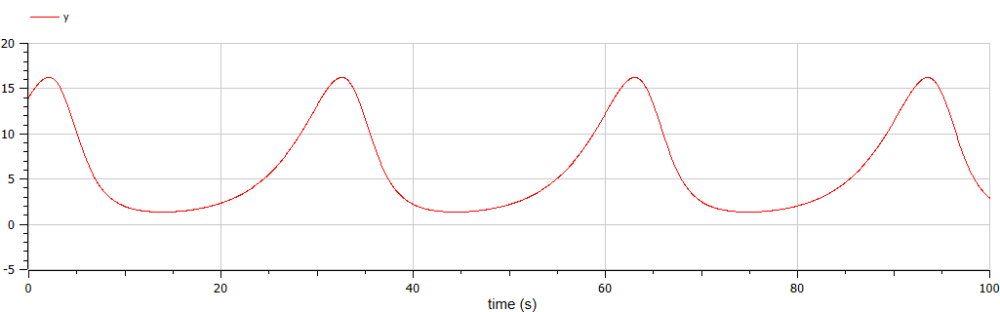

# Лабораторная работа №5
##  Модель Лотки-Вольтерры

Выполнила: Пономарева Лилия Михайловна
НПИбд-02-19
___
# Цель

Рассмотреть простейшую модель взаимодействия двух видов типа «хищник — жертва» - модель Лотки-Вольтерры.  
___
# Задача

Для модели «хищник-жертва»:  

$$
 \begin{cases}
	\frac{dx}{dt} = -0.21x(t) + 0.035x(t)y(t)
	\\   
	\frac{dy}{dt} = 0.25y(t) - 0.021x(t)y(t)
 \end{cases}
$$

Построить график зависимости численности хищников от численности жертв, а также графики изменения численности хищников и численности жертв при следующих начальных условиях: $x_0=6, y_0=14$.
 Найти стационарное состояние системы. 
___
# Решение

```
model lab5
  parameter Real a = 0.21;
  parameter Real b = 0.035;
  parameter Real c = 0.25;
  parameter Real d = 0.021;
  parameter Real x0 = 6;
  parameter Real y0 = 14
  //parameter Real x0 = c/d;
  //parameter Real y0 = a/b;
  Real x(start=x0);
  Real y(start=y0);
equation
  der(x) = -a*x + b*x*y;
  der(y) = c*y - d*x*y;
  annotation(experiment(StartTime=0, StopTime=100, Tplerance=1e-06,Interval=0.05));
end lab5;
```
___
# Результат работы программы
График зависимости численности хищников от численности жертв с начальными значениями у=14, х=6


___
# Результат работы программы
Зависимость изменения численности хищников от изменения численности жертв с начальными значениями у=14, х=6


___
# Результат работы программы
График изменения численности хищников


___
# Результат работы программы
График изменения численности жертв


___
# Результат работы программы

Стационарное состояние: $x_0=\frac{c}{d}=11.90476, y_0=\frac{a}{b}=6$.


___
# Вывод

Рассмотрели простейшую модель взаимодействия двух видов типа «хищник — жертва» - модель Лотки-Вольтерры. 
___
# Список литературы

1. [Модель Лотки-Вольтерры](https://math-it.petrsu.ru/users/semenova/MathECO/Lections/Lotka_Volterra.pdf)
2. [Документация по системе Modelica](https://www.modelica.org/)