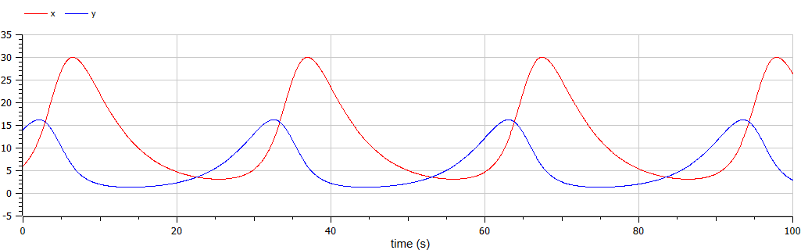
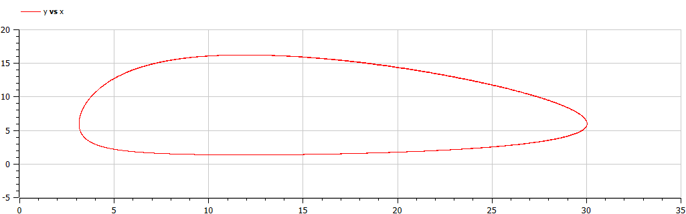
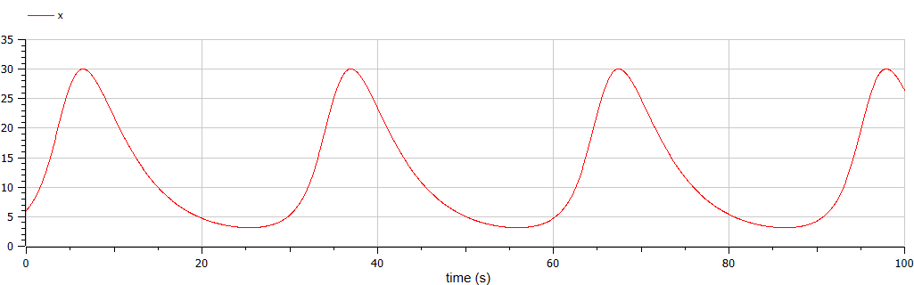
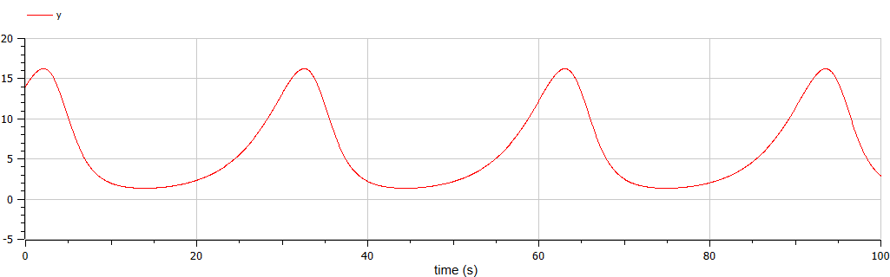
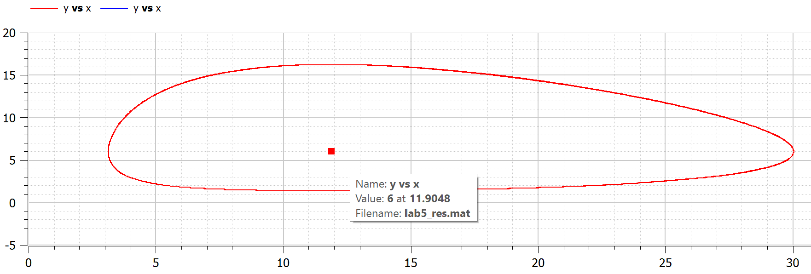

---
## Front matter
lang: ru-RU
title: "Лабораторная работа №5"
author: |
    Пономарева Лилия\inst{1}

institute: |
	\inst{1}RUDN University, Moscow, Russian Federation
  
date: 2022, 12 March, 2022 Moscow, Russian Federation  

## Formatting
mainfont: PT Serif
romanfont: PT Serif
sansfont: PT Sans
monofont: PT Mono
toc: false
slide_level: 2
theme: metropolis
header-includes: 
 - \metroset{progressbar=frametitle,sectionpage=progressbar,numbering=fraction}
 - '\makeatletter'
 - '\beamer@ignorenonframefalse'
 - '\makeatother'
aspectratio: 43
section-titles: true
---

# Цель выполнения лабораторной работы

Рассмотреть простейшую модель взаимодействия двух видов типа «хищник — жертва» - модель Лотки-Вольтерры.  

# Задача

Для модели «хищник-жертва»:  

$$
 \begin{cases}
	\frac{dx}{dt} = -0.21x(t) + 0.035x(t)y(t)
	\\   
	\frac{dy}{dt} = 0.25y(t) - 0.021x(t)y(t)
 \end{cases}
$$

Построить график зависимости численности хищников от численности жертв, а также графики изменения численности хищников и численности жертв при следующих начальных условиях: $x_0=6, y_0=14$. Найти стационарное состояние системы. 

# Решение

```
model lab5
  parameter Real a = 0.21;
  parameter Real b = 0.035;
  parameter Real c = 0.25;
  parameter Real d = 0.021;
  
  parameter Real x0 = 6;
  parameter Real y0 = 14;

  //parameter Real x0 = c/d;
  //parameter Real y0 = a/b;
  
  Real x(start=x0);
  Real y(start=y0);
  
equation
  der(x) = -a*x + b*x*y;
  der(y) = c*y - d*x*y;
    
  annotation(experiment(StartTime=0, StopTime=100, Tplerance=1e-06,Interval=0.05));
end lab5;
```

# Результат работы программы

{ #fig:001, width=70%}

# Результат работы программы

{ #fig:002 width=70%}

# Результат работы программы

{ #fig:003 width=70%}

# Результат работы программы

{ #fig:004 width=70%} 

# Результат работы программы

Стационарное состояние будет иметь значения $x_0=\frac{c}{d}=\frac{0.25}{0.021}=11.90476, y_0=\frac{a}{b}=\frac{0.21}{0.035}=6$.

{ #fig:005 width=70%}

# Вывод

Рассмотрели простейшую модель взаимодействия двух видов типа «хищник — жертва» - модель Лотки-Вольтерры. 