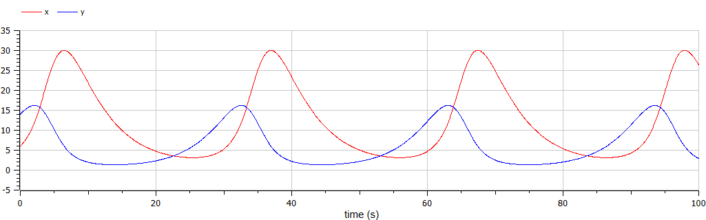
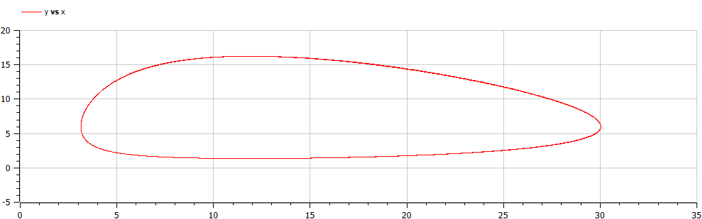

---
# Front matter
lang: ru-RU
title: "Отчет по лабораторной работе №5"
subtitle: "Модель Лотки-Вольтерры - вариант 44"
author: "Пономарева Лилия НПИбд-02-19"


# Generic otions
lang: ru-RU
toc-title: "Содержание"

# Bibliography
bibliography: bib/cite.bib
csl: pandoc/csl/gost-r-7-0-5-2008-numeric.csl

# Formatting
toc-title: "Содержание"
toc: true # Table of contents
toc_depth: 2
lof: true # List of figures
fontsize: 12pt
linestretch: 1.5
papersize: a4paper
documentclass: scrreprt
polyglossia-lang: russian
polyglossia-otherlangs: english
mainfont: PT Serif
romanfont: PT Serif
sansfont: PT Sans
monofont: PT Mono
mainfontoptions: Ligatures=TeX
romanfontoptions: Ligatures=TeX
sansfontoptions: Ligatures=TeX,Scale=MatchLowercase
monofontoptions: Scale=MatchLowercase
## Biblatex
biblatex: true
biblio-style: "gost-numeric"
biblatexoptions:
  - parentracker=true
  - backend=biber
  - hyperref=auto
  - language=auto
  - autolang=other*
  - citestyle=gost-numeric
indent: true
pdf-engine: lualatex
header-includes:
  - \linepenalty=10 # the penalty added to the badness of each line within a paragraph (no associated penalty node) Increasing the υalue makes tex try to haυe fewer lines in the paragraph.
  - \interlinepenalty=0 # υalue of the penalty (node) added after each line of a paragraph.
  - \hyphenpenalty=50 # the penalty for line breaking at an automatically inserted hyphen
  - \exhyphenpenalty=50 # the penalty for line breaking at an explicit hyphen
  - \binoppenalty=700 # the penalty for breaking a line at a binary operator
  - \relpenalty=500 # the penalty for breaking a line at a relation
  - \clubpenalty=150 # extra penalty for breaking after first line of a paragraph
  - \widowpenalty=150 # extra penalty for breaking before last line of a paragraph
  - \displaywidowpenalty=50 # extra penalty for breaking before last line before a display math
  - \brokenpenalty=100 # extra penalty for page breaking after a hyphenated line
  - \predisplaypenalty=10000 # penalty for breaking before a display
  - \postdisplaypenalty=0 # penalty for breaking after a display
  - \floatingpenalty = 20000 # penalty for splitting an insertion (can only be split footnote in standard LaTeX)
  - \raggedbottom # or \flushbottom
  - \usepackage{float} # keep figures where there are in the text
  - \floatplacement{figure}{H} # keep figures where there are in the text
---

# Цель работы

Рассмотреть простейшую модель взаимодействия двух видов типа «хищник — жертва» - модель Лотки-Вольтерры.

## Объект исследования

Модель взаимодействия двух видов типа «хищник — жертва».

## Предмет исследования

Алгоритм решения задачи о моделе взаимодействия двух видов типа «хищник — жертва».

# Теоретические сведения

В данной лабораторной работе рассматривается математическая модель системы «Хищник-жертва» на примере модели Лотки-Вольтерры.[[1]](#список-литературы)

Данная двувидовая модель основывается на 
следующих предположениях:

1. Численность популяции жертв и хищников зависят только от времени (модель не учитывает пространственное распределение популяции на занимаемой территории);
2. В отсутствии взаимодействия численность видов изменяется по модели Мальтуса, при этом число жертв увеличивается, а число хищников падает;
3. Естественная смертность жертвы и естественная рождаемость хищника считаются несущественными;
4. Эффект насыщения численности обеих популяций не учитывается;
5. Скорость роста численности жертв уменьшается пропорционально численности хищников.

$$
 \begin{cases}
	\frac{dx}{dt} = ax(t) - bx(t)y(t)
	\\   
	\frac{dy}{dt} = -cy(t) + dx(t)y(t)
 \end{cases}
$$

Коэффициент $a$ описывает скорость естественного прироста числа жертв в отсутствие хищников, $с$ - естественное вымирание хищников, лишенных пищи в виде жертв. Вероятность 
взаимодействия жертвы и хищника считается пропорциональной как количеству 
жертв, так и числу самих хищников $(xy)$. Каждый акт взаимодействия уменьшает 
популяцию жертв, но способствует увеличению популяции хищников (члены $-bxy$
и $dxy$ в правой части уравнения).

В зависимости от этих параметрах система и будет изменяться. Однако следует выделить одно важное состояние системы, при котором не происходит никаких изменений ни со стороны хищников, ни со стороны жертв. Так называемое, стационарное состояние системы, при котором изменение численности популяции равно нулю.
При отсутствии изменений в системе $\frac{dx}{dt} = 0, \frac{dy}{dt} = 0$.

Стационарное состояние системы будет в точке: 
$$
	x_0=\frac{a}{b}, y_0=\frac{c}{d}
$$
При малом отклонении от положения 
равновесия численности как хищника, так и жертвы с течением времени не возвращаются к равновесным значениям, а совершают периодические колебания 
вокруг стационарной точки.

# Выполнение лабораторной работы
## 1. Задание
**[Вариант 44]**
В лесу проживают $х$ число волков, питающихся зайцами, число которых в этом же лесу $у$. Пока число зайцев достаточно велико, для прокормки всех волков, численность волков растет до тех пор, пока не наступит момент, что корма перестанет хватать на всех. Тогда волки начнут умирать, и их численность будет уменьшаться. В этом случае в какой-то момент времени численность зайцев снова начнет увеличиваться, что повлечет за собой новый рост популяции волков. Такой 
цикл будет повторяться, пока обе популяции будут существовать. Помимо этого, на численность стаи влияют болезни и старение. 
Данная модель будет описываться следующим уравнением:
$$
 \begin{cases}
	\frac{dx}{dt} = -0.21x(t) + 0.035x(t)y(t)
	\\   
	\frac{dy}{dt} = 0.25y(t) - 0.021x(t)y(t)
 \end{cases}
$$

Построить график зависимости численности хищников от численности жертв, а также графики изменения численности хищников и численности жертв при следующих начальных условиях: $x_0=6, y_0=14$.
Найти стационарное состояние системы.

## 2. Построение графиков
### 2.1. Код в среде OpenModelica

Написали программу на Modelica.[[2]](#список-литературы)

```
model lab5
  parameter Real a = 0.21; // коэффициент естественной смертности хищников
  parameter Real b = 0.035; // коэффициент увеличения числа хищников
  parameter Real c = 0.25; // коэффициент естественного прироста жертв
  parameter Real d = 0.021; // коэффициент смертности жертв
  
  parameter Real x0 = 6; // изначальная численность хищников
  parameter Real y0 = 14; // изначальная численность жертв
  
  //parameter Real x0 = c/d; // стационарное значение для хищников
  //parameter Real y0 = a/b; // стационарное значение для жертв
  
  Real x(start=x0);
  Real y(start=y0);
  
equation
  der(x) = -a*x + b*x*y;
  der(y) = c*y - d*x*y;
    
  annotation(experiment(StartTime=0, StopTime=100, Tplerance=1e-06,Interval=0.05));
end lab5;
```

### 2.2. Полученные графики

После запуска кода программы получили график зависимости численности хищников от численности жертв (рис. -@fig:001), фазовый портрет этой зависимости (рис. -@fig:002) а также графики изменения численности хищников и численности жертв (рис. -@fig:003 и -@fig:004).

{ #fig:001 width=70% height=70% }

{ #fig:002 width=70% height=70% }

{ #fig:003 width=70% height=70% }

{ #fig:004 width=70% height=70% }

## 3. Нахождение стационарного состояния

Стационарное состояние будет иметь значения $x_0=\frac{c}{d}=\frac{0.25}{0.021}=11.90476, y_0=\frac{a}{b}=\frac{0.21}{0.035}=6$(рис. -@fig:005).

{ #fig:005 width=70% height=70%}

## 4. Анализ результатов
По графикам видим, что при росте числа жертв растет количсетво хищников. Примерно после того, как число хищников достигает числа жертв, число жертв начинает снижаться. Число хищников продолжает расти до некоторого почти нулевого числа жертв и после тоже начинает падать. Из-за падения количества хищников, начинает рости количество жертв. И цикл продолжается.

# Выводы

Рассмотрели простейшую модель взаимодействия двух видов типа «хищник — жертва» - модель Лотки-Вольтерры.

# Список литературы {.unnumbered}

1. [Модель Лотки-Вольтерры](https://math-it.petrsu.ru/users/semenova/MathECO/Lections/Lotka_Volterra.pdf)
2. [Документация по системе Modelica](https://www.modelica.org/)