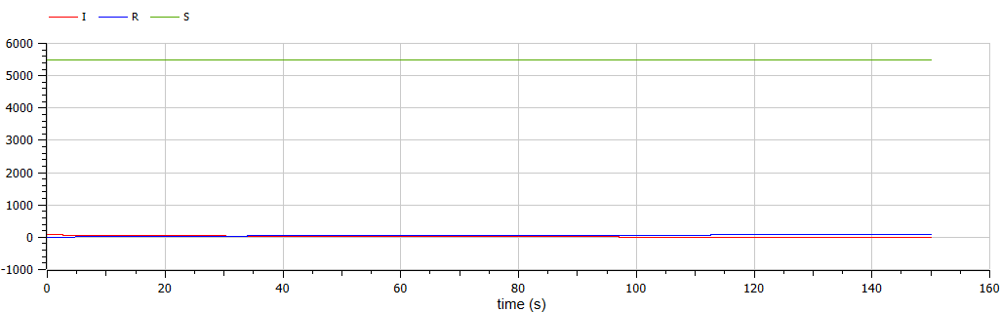
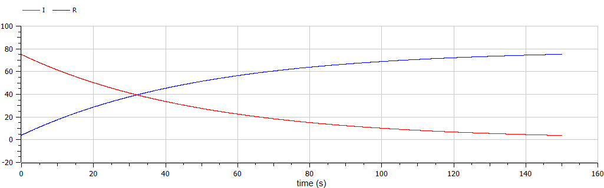
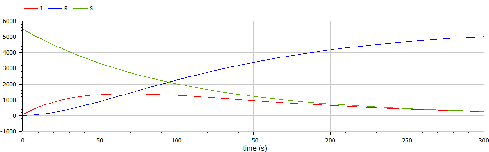

---
## Front matter
lang: ru-RU
title: "Лабораторная работа №6"
subtitle: "Задача об эпидемии"
author:
    Лилия М. Пономарёва
    НПИбд-02-19\inst{1}
institute: |
	\inst{1}RUDN University, Moscow, Russian Federation
date: 2022, 19 March, Moscow, Russian Federation  

## Formatting
mainfont: PT Serif
romanfont: PT Serif
sansfont: PT Sans
monofont: PT Mono
toc: false
slide_level: 2
theme: metropolis
header-includes: 
 - \metroset{progressbar=frametitle,sectionpage=progressbar,numbering=fraction}
 - '\makeatletter'
 - '\beamer@ignorenonframefalse'
 - '\makeatother'
 - \usepackage[T2A]{fontenc}
 - \usepackage{amsmath}
aspectratio: 43
section-titles: true
---

# Цель работы
Рассмотреть простейшую модель эпидемии.

# Задание
[Вариант 44]  
На одном острове вспыхнула эпидемия. Известно, что из всех проживающих 
на острове ($N=5555$) в момент начала эпидемии ($t=0$) число заболевших людей (являющихся распространителями инфекции) $I(0)=75$, А число здоровых людей с иммунитетом к болезни $R(0)=4$. Таким образом, число людей восприимчивых к болезни, но пока здоровых, в начальный момент времени $S(0)=5476$.  
Постройте графики изменения числа особей в каждой из трех групп. 
Рассмотрите, как будет протекать эпидемия в случае:  
1) если $I(0) <= I^*$  
2) если $I(0) > I^*$

# Решение для случая $I(0) <= I^*$ 
```
model lab6
  parameter Real N = 5555;
  parameter Real I0 = 75;
  parameter Real R0 = 4;
  parameter Real S0 = N-I0-R0;
  parameter Real a = 0.01;
  parameter Real b = 0.02;
  Real I(start = I0);
  Real R(start = R0);
  Real S(start = S0);
equation
  der(S) = 0;
  der(I) = -b*I;
  der(R) = b*I;
end lab6;
```
# Результат работы программы 
{ #fig:001 width=70% }  

# Результат работы программы  
{ #fig:002 width=70% }  

# Решение для случая $I(0) > I^*$ 
```
model lab6
  parameter Real N = 5555;
  parameter Real I0 = 75;
  parameter Real R0 = 4;
  parameter Real S0 = N-I0-R0;
  parameter Real a = 0.01;
  parameter Real b = 0.02;
  Real I(start = I0);
  Real R(start = R0);
  Real S(start = S0);
equation
  der(S) = -a*S;
  der(I) = a*S - b*I;
  der(R) = b*I;
end lab6;
```
# Результат работы программы 
{ #fig:003 width=70% }

# Вывод
Рассмотрели простейшую модель эпидемии.  

# Список литературы {.unnumbered}
1. [Compartmental models in epidemiology](https://en.wikipedia.org/wiki/Compartmental_models_in_epidemiology)
2. [Документация по системе Modelica](https://www.modelica.org/)