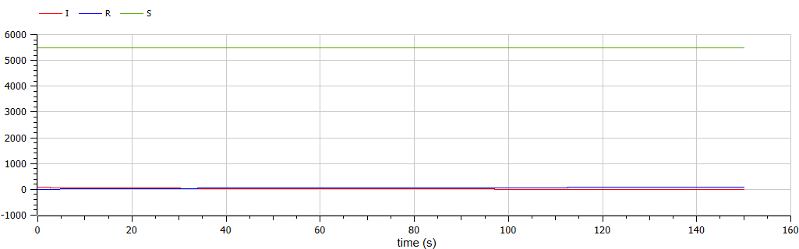
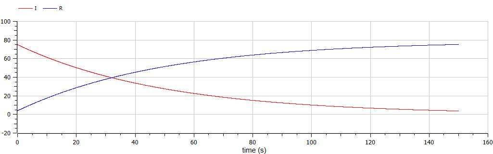
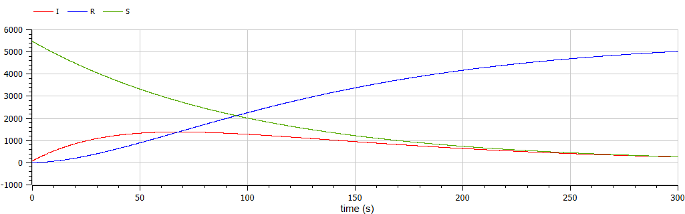

---
# Front matter
lang: ru-RU
title: "Отчет по лабораторной работе №6"
subtitle: "Задача об эпидемии - вариант 44"
author: "Пономарева Лилия НПИбд-02-19"


# Generic otions
lang: ru-RU
toc-title: "Содержание"

# Bibliography
bibliography: bib/cite.bib
csl: pandoc/csl/gost-r-7-0-5-2008-numeric.csl

# Formatting
toc-title: "Содержание"
toc: true # Table of contents
toc_depth: 2
lof: true # List of figures
fontsize: 12pt
linestretch: 1.5
papersize: a4paper
documentclass: scrreprt
polyglossia-lang: russian
polyglossia-otherlangs: english
mainfont: PT Serif
romanfont: PT Serif
sansfont: PT Sans
monofont: PT Mono
mainfontoptions: Ligatures=TeX
romanfontoptions: Ligatures=TeX
sansfontoptions: Ligatures=TeX,Scale=MatchLowercase
monofontoptions: Scale=MatchLowercase
## Biblatex
biblatex: true
biblio-style: "gost-numeric"
biblatexoptions:
  - parentracker=true
  - backend=biber
  - hyperref=auto
  - language=auto
  - autolang=other*
  - citestyle=gost-numeric
indent: true
pdf-engine: xelatex
header-includes:
  - \linepenalty=10 # the penalty added to the badness of each line within a paragraph (no associated penalty node) Increasing the υalue makes tex try to haυe fewer lines in the paragraph.
  - \interlinepenalty=0 # υalue of the penalty (node) added after each line of a paragraph.
  - \hyphenpenalty=50 # the penalty for line breaking at an automatically inserted hyphen
  - \exhyphenpenalty=50 # the penalty for line breaking at an explicit hyphen
  - \binoppenalty=700 # the penalty for breaking a line at a binary operator
  - \relpenalty=500 # the penalty for breaking a line at a relation
  - \clubpenalty=150 # extra penalty for breaking after first line of a paragraph
  - \widowpenalty=150 # extra penalty for breaking before last line of a paragraph
  - \displaywidowpenalty=50 # extra penalty for breaking before last line before a display math
  - \brokenpenalty=100 # extra penalty for page breaking after a hyphenated line
  - \predisplaypenalty=10000 # penalty for breaking before a display
  - \postdisplaypenalty=0 # penalty for breaking after a display
  - \floatingpenalty = 20000 # penalty for splitting an insertion (can only be split footnote in standard LaTeX)
  - \raggedbottom # or \flushbottom
  - \usepackage{float} # keep figures where there are in the text
  - \floatplacement{figure}{H} # keep figures where there are in the text
---

# Цель работы
Рассмотреть простейшую модель эпидемии.

## Объект исследования
Эпидемическая вспышка.

## Предмет исследования
Закон изменения количества заболевших и выздоровевших во время эпидемии.

# Теоретические сведения
Рассмотрим простейшую модель эпидемии[[1]](#список-литературы).  
Предположим, что некая популяция, состоящая из $N$ особей, (считаем, что популяция изолирована) подразделяется на три группы. Первая группа - это восприимчивые к болезни, но пока здоровые особи, обозначим их через $S(t)$. Вторая группа – это число инфицированных особей, которые также при этом являются распространителями инфекции, обозначим их $I(t)$. А третья группа, обозначающаяся через $R(t)$ – это здоровые особи с иммунитетом к болезни. 
До того, как число заболевших не превышает критического значения $I^*$, считаем, что все больные изолированы и не заражают здоровых. Когда $I(t)> I^*$, тогда инфицированные способны заражать восприимчивых к болезни особей. 

Таким образом, скорость изменения числа $S(t)$ меняется по следующему закону:

$$
\frac{dS}{dt}=
 \begin{cases}
	-\alpha S &\text{,если $I(t) > I^*$}
	\\   
	0 &\text{,если $I(t) \leq I^*$}
 \end{cases}
$$

Поскольку каждая восприимчивая к болезни особь, которая, в конце концов, заболевает, сама становится инфекционной, то скорость изменения числа инфекционных особей представляет разность за единицу времени между заразившимися и теми, кто уже болеет и лечится. т.е.:

$$
\frac{dI}{dt}=
 \begin{cases}
	\alpha S -\beta I &\text{,если $I(t) > I^*$}
	\\   
	-\beta I &\text{,если $I(t) \leq I^*$}
 \end{cases}
$$

А скорость изменения выздоравливающих особей (при этом приобретающие иммунитет к болезни):

$$\frac{dR}{dt} = \beta I$$

Постоянные пропорциональности $\alpha, \beta$ - это коэффициенты заболеваемости и выздоровления соответственно. Для того, чтобы решения соответствующих уравнений определялось однозначно, необходимо задать начальные условия. Считаем, что на начало эпидемии в момент времени $t=0$ нет особей с иммунитетом к болезни $R(0)=0$, а число инфицированных и восприимчивых к болезни особей $I(0)$ и $S(0)$ соответственно. Для анализа картины протекания эпидемии необходимо рассмотреть два случая:  $I(0) \leq I^*$ и  $I(0)>I^*$.

# Выполнение лабораторной работы
## Задание
**[Вариант 44]**  
На одном острове вспыхнула эпидемия. Известно, что из всех проживающих 
на острове ($N=5555$) в момент начала эпидемии ($t=0$) число заболевших людей (являющихся распространителями инфекции) $I(0)=75$, А число здоровых людей с иммунитетом к болезни $R(0)=4$. Таким образом, число людей восприимчивых к болезни, но пока здоровых, в начальный момент времени $S(0)=N-I(0)-R(0)$.
Постройте графики изменения числа особей в каждой из трех групп. 
Рассмотрите, как будет протекать эпидемия в случае:  
1) если $I(0) <= I^*$  
2) если $I(0) > I^*$

## Случай первый
Написали программу моделирующую протекание эпидемии в случае $I(0) <= I^*$ на языке Modelica.[[2]](#список-литературы)
```
model lab6
  parameter Real N = 5555;
  parameter Real I0 = 75;
  parameter Real R0 = 4;
  parameter Real S0 = N-I0-R0;
  parameter Real a = 0.01;
  parameter Real b = 0.02;
  
  Real I(start = I0);
  Real R(start = R0);
  Real S(start = S0);
equation
  der(S) = 0;
  der(I) = -b*I;
  der(R) = b*I;
end lab6;
```
Получили графики изменения числа не переболевших, переболевших и зараженных (рис. [-@fig:001] и рис. [-@fig:002]).

{ #fig:001 width=70% }  


{ #fig:002 width=70% }  

## Случай второй
Написали программу моделирующую протекание эпидемии в случае $I(0) > I^*$ на языке Modelica.[[2]](#список-литературы)

```
model lab6
  parameter Real N = 5555;
  parameter Real I0 = 75;
  parameter Real R0 = 4;
  parameter Real S0 = N-I0-R0;
  parameter Real a = 0.01;
  parameter Real b = 0.02;
  
  Real I(start = I0);
  Real R(start = R0);
  Real S(start = S0);
equation
  der(S) = -a*S;
  der(I) = a*S - b*I;
  der(R) = b*I;
end lab6;
```
Получили графики изменения числа не переболевших, переболевших и зараженных (рис. [-@fig:003]).

{ #fig:003 width=70% }

# Выводы

Рассмотрели простейшую модель эпидемии.  
В случае, когда начальное значение инфицированных ниже критического значения, при котором инфицированные способны заражать восприимчивых к болезни особей, число особей не зараженных и не обладающих имунитетом остается одинаковым, число зараженных постепенно снижается, а число выздоровевших и более не восприимчивых к болезни увеличивается.  
В случае, когда начальное значение инфицированных выше критического значения, число особей не зараженных и не обладающих имунитетом постепенно снижается до достижения нулевых значений; число зараженных сначала быстро увеличивается, потом медленнее уменьшается пока также не достигает нуля, а число выздоровевших и более не восприимчивых к болезни увеличивается до значений равных численностей всей популяции.

# Список литературы {.unnumbered}

1. [Compartmental models in epidemiology](https://en.wikipedia.org/wiki/Compartmental_models_in_epidemiology)
2. [Документация по системе Modelica](https://www.modelica.org/)