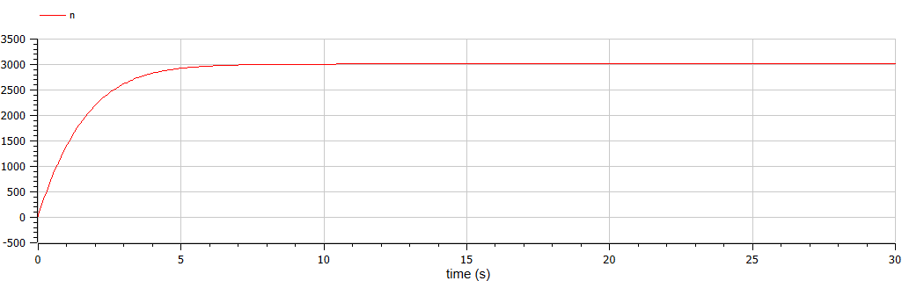
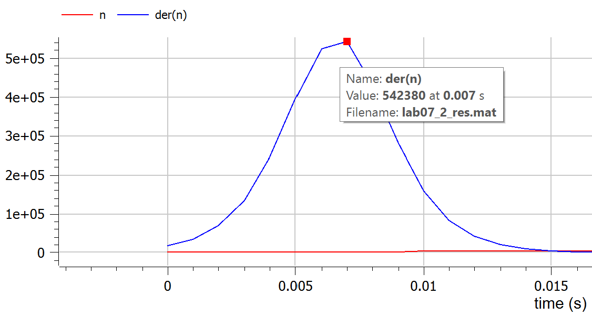
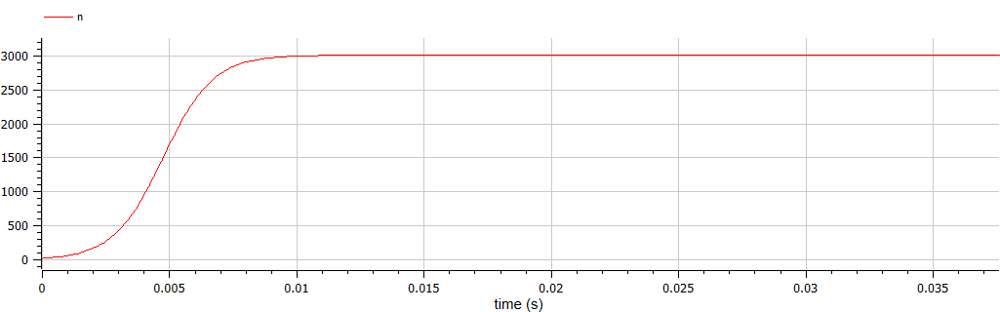

---
## Front matter
lang: ru-RU
title: "Лабораторная работа №7"
subtitle: "Эффективность рекламы"
author:
    Лилия М. Пономарёва
    НПИбд-02-19\inst{1}
institute: |
	\inst{1}RUDN University, Moscow, Russian Federation
date: 2022, 19 March, Moscow, Russian Federation  

## Formatting
mainfont: PT Serif
romanfont: PT Serif
sansfont: PT Sans
monofont: PT Mono
toc: false
slide_level: 2
theme: metropolis
header-includes: 
 - \metroset{progressbar=frametitle,sectionpage=progressbar,numbering=fraction}
 - '\makeatletter'
 - '\beamer@ignorenonframefalse'
 - '\makeatother'
 - \usepackage[T2A]{fontenc}
 - \usepackage{amsmath}
aspectratio: 43
section-titles: true
---

# Цель работы
Рассмотреть модель рекламной кампании.

# Задание
[Вариант 44]  
Постройте график распространения рекламы, математическая модель которой описывается следующим уравнением:  
1. $\frac{\partial n}{\partial t} = (0.566+0.000066n(t))(N-n(t))$  
2. $\frac{\partial n}{\partial t} = (0.000044+0.244n(t))(N-n(t))$  
3. $\frac{\partial n}{\partial t} = (0.44t+0.34cos(t)n(t))(N-n(t))$  
При этом объем аудитории $N=3010$, в начальный момент о товаре знает 23 человека. Для случая 2 определите в какой момент времени скорость распространения рекламы будет иметь максимальное значение.

# Уравнение первое
```
model lab07_1
  parameter Real N=3010;
  Real n(start=23);
equation
    der(n)=(0.566 + 0.000066*n)*(N - n); 
end lab07_1;
```
# Результат работы программы 
{ #fig:001 width=70% }  

# Уравнение второе
```
model lab07_2
  parameter Real N=3010;
  Real n(start=23);
equation
  der(n)=(0.000044 + 0.244*n)*(N - n); 
end lab07_2;
```
# Результат работы программы 
{ #fig:002 width=70% }  

# Максимальное значение скорости распространения информации
{ #fig:003 width=70% }  

# Уравнение третье
```
model lab07_3
  parameter Real N=3010;
  Real n(start=23);
equation
  der(n)=(0.44*time + 0.34*cos(time)*n)*(N - n); 
end lab07_3;
```

# Результат работы программы
{ #fig:004 width=70% } 

# Вывод
Рассмотрели модель рекламной кампании.  

# Список литературы {.unnumbered}
1. [Compartmental models in epidemiology](https://en.wikipedia.org/wiki/Compartmental_models_in_epidemiology)
2. [Документация по системе Modelica](https://www.modelica.org/)