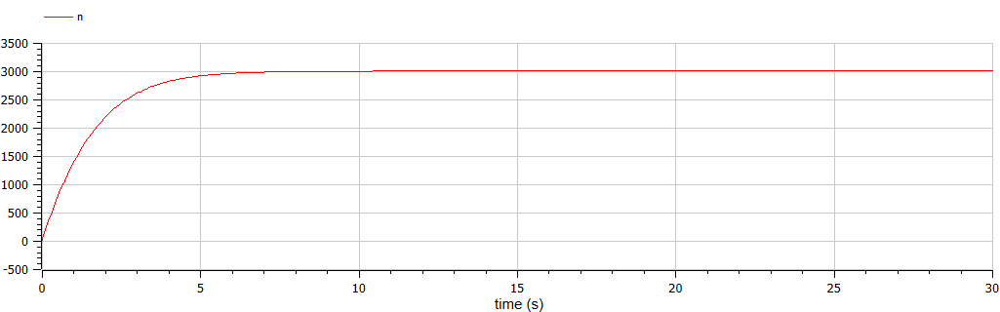
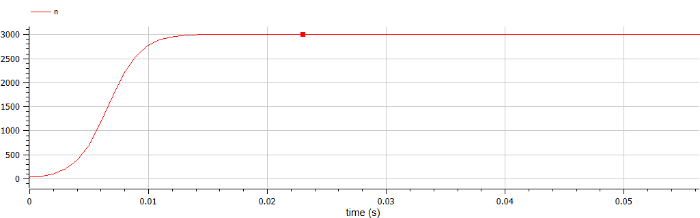

---
# Front matter
lang: ru-RU
title: "Отчет по лабораторной работе №7"
subtitle: "Эффективность рекламы - вариант 44"
author: "Пономарева Лилия НПИбд-02-19"


# Generic otions
lang: ru-RU
toc-title: "Содержание"

# Bibliography
bibliography: bib/cite.bib
csl: pandoc/csl/gost-r-7-0-5-2008-numeric.csl

# Formatting
toc-title: "Содержание"
toc: true # Table of contents
toc_depth: 2
lof: true # List of figures
fontsize: 12pt
linestretch: 1.5
papersize: a4paper
documentclass: scrreprt
polyglossia-lang: russian
polyglossia-otherlangs: english
mainfont: PT Serif
romanfont: PT Serif
sansfont: PT Sans
monofont: PT Mono
mainfontoptions: Ligatures=TeX
romanfontoptions: Ligatures=TeX
sansfontoptions: Ligatures=TeX,Scale=MatchLowercase
monofontoptions: Scale=MatchLowercase
## Biblatex
biblatex: true
biblio-style: "gost-numeric"
biblatexoptions:
  - parentracker=true
  - backend=biber
  - hyperref=auto
  - language=auto
  - autolang=other*
  - citestyle=gost-numeric
indent: true
pdf-engine: xelatex
header-includes:
  - \linepenalty=10 # the penalty added to the badness of each line within a paragraph (no associated penalty node) Increasing the υalue makes tex try to haυe fewer lines in the paragraph.
  - \interlinepenalty=0 # υalue of the penalty (node) added after each line of a paragraph.
  - \hyphenpenalty=50 # the penalty for line breaking at an automatically inserted hyphen
  - \exhyphenpenalty=50 # the penalty for line breaking at an explicit hyphen
  - \binoppenalty=700 # the penalty for breaking a line at a binary operator
  - \relpenalty=500 # the penalty for breaking a line at a relation
  - \clubpenalty=150 # extra penalty for breaking after first line of a paragraph
  - \widowpenalty=150 # extra penalty for breaking before last line of a paragraph
  - \displaywidowpenalty=50 # extra penalty for breaking before last line before a display math
  - \brokenpenalty=100 # extra penalty for page breaking after a hyphenated line
  - \predisplaypenalty=10000 # penalty for breaking before a display
  - \postdisplaypenalty=0 # penalty for breaking after a display
  - \floatingpenalty = 20000 # penalty for splitting an insertion (can only be split footnote in standard LaTeX)
  - \raggedbottom # or \flushbottom
  - \usepackage{float} # keep figures where there are in the text
  - \floatplacement{figure}{H} # keep figures where there are in the text
---

# Цель работы
Рассмотреть модель рекламной кампании.

## Объект исследования
Рекламная кампания.

## Предмет исследования
Изучение эффективности рекламной стратегии.

# Теоретические сведения
Рассмотрим модель рекламной кампании[[1]](#список-литературы).  
Организуется рекламная кампания нового товара или услуги. Необходимо, чтобы прибыль будущих продаж с избытком покрывала издержки на рекламу.
Вначале расходы могут превышать прибыль, поскольку лишь малая часть потенциальных покупателей будет информирована о новинке. Затем, при увеличении числа продаж, возрастает и прибыль, и, наконец, наступит момент, когда рынок насытиться, и рекламировать товар станет бесполезным.  
Предположим, что торговыми учреждениями реализуется некоторая продукция, о которой в момент времени t из числа потенциальных покупателей N знает лишь n покупателей. Для ускорения сбыта продукции запускается реклама по радио, телевидению и других средств массовой информации. После запуска рекламной кампании информация о продукции начнет распространяться среди потенциальных покупателей путем общения друг с другом. Таким образом, после запуска рекламных объявлений скорость изменения числа знающих о продукции людей пропорциональна как числу знающих о товаре покупателей, так и числу покупателей о нем не знающих.  
Модель рекламной кампании описывается следующими величинами. Считаем, что $\frac{\partial n}{\partial t}$ - скорость изменения со временем числа потребителей, узнавших о товаре и готовых его купить, t - время, прошедшее с начала рекламной кампании, n(t) - число уже информированных клиентов. Эта величина пропорциональна числу покупателей, еще не знающих о нем, это описывается следующим образом: $a_{1}(t)(N-n(t))$, где N - общее число потенциальных платежеспособных покупателей, $a_{1}(t)>0$ - характеризует интенсивность рекламной кампании (зависит от затрат на рекламу в данный момент времени). Помимо этого, узнавшие о товаре потребители также распространяют полученную информацию среди потенциальных покупателей, не знающих о нем (в этом случае работает т.н. сарафанное радио). Этот вклад в рекламу описывается величиной $a_{2}(t)n(t)(N-n(t))$, эта величина увеличивается с увеличением потребителей узнавших о товаре. Математическая модель распространения рекламы описывается уравнением: 
$$\frac{\partial n}{\partial t} = (a_1(t)+a_2(t)*n(t))(N-n(t))$$


# Выполнение лабораторной работы
## Задание
**[Вариант 44]**  
Постройте график распространения рекламы, математическая модель которой описывается следующим уравнением:  
1. $\frac{\partial n}{\partial t} = (0.566+0.000066n(t))(N-n(t))$  
2. $\frac{\partial n}{\partial t} = (0.000044+0.244n(t))(N-n(t))$  
3. $\frac{\partial n}{\partial t} = (0.44t+0.34cos(t)n(t))(N-n(t))$  
При этом объем аудитории $N=3010$, в начальный момент о товаре знает 23 человека. Для случая 2 определите в какой момент времени скорость распространения рекламы будет иметь максимальное значение.

## Уравнение первое
Написали программу моделирующую распространение информации с помощью рекламы при $a_{1}(t) >> a_{2}(t)$ на языке Modelica.[[2]](#список-литературы)
```
model lab07_1
  parameter Real N=3010;
  Real n(start=23);
equation
    der(n)=(0.566 + 0.000066*n)*(N - n); 
end lab07_1;
```
Получили график распространения информации с помощью рекламы при $a_{1}(t) >> a_{2}(t)$ (рис. [-@fig:001]).

{ #fig:001 width=70% }  

## Уравнение второе
Написали программу моделирующую распространение информации с помощью рекламы при $a_{1}(t) << a_{2}(t)$ на языке Modelica.[[2]](#список-литературы)
```
model lab07_2
  parameter Real N=3010;
  Real n(start=23);
equation
  der(n)=(0.000044 + 0.244*n)*(N - n); 
end lab07_2;
```
Получили график распространения информации с помощью рекламы при $a_{1}(t) << a_{2}(t)$ (рис. [-@fig:002]).

{ #fig:002 width=70% }  

Нашли момент времени, когда скорость распространения рекламы имеет максимальное значение (рис. [-@fig:003]).

{ #fig:003 width=70% }  

## Уравнение третье
Написали программу моделирующую распространение информации с помощью рекламы на языке Modelica.[[2]](#список-литературы)
```
model lab07_3
  parameter Real N=3010;
  Real n(start=23);
equation
  der(n)=(0.44*time + 0.34*cos(time)*n)*(N - n); 
end lab07_3;
```
Получили график распространения информации с помощью рекламы (рис. [-@fig:004]).

{ #fig:004 width=70% } 
 
# Выпросы к лабораторной работе
1. Записать модель Мальтуса (дать пояснение, где используется данная модель).  
$P(t) = P_0e^{rt}$, где $P0 = P(0)$ — исходная численность населения, $r$ — темп прироста населения, $t$ — время.
Модель описывает экспоненциальный рост с постоянным темпом.
Примеры использования:
- Скорость изменения населенияпропорциональна численностинаселения умноженного на сумму коэффициентов рождения ($\alpha$) и смертности ($\beta$). 
- Скорость распада атомов урана пропорционально числу частиц радиоактивного материала. 

2. Записать уравнение логистической кривой (дать пояснение, что описывает данное уравнение).   
$P(t) = \frac{1}{1+e^{-t}}$, где переменная $P$ - численность населения, переменная t – время.  
Моделирует кривую роста вероятности некоего события, по мере изменения управляющих параметров.
Начальная стадия роста логистической кривой приблизительно соответствует экспоненте (показательная функция). Затем, по мере насыщения, рост замедляется, проходит линейную фазу и, наконец, и в зрелом периоде практически останавливается.  

3. На что влияет коэффициент $a_1(t)$ и $a_2(t)$ в модели распространения рекламы?  

$a_1$ - это интенсивность рекламной кампании, $a_2(t)$ - это влияние сарафанного радио.  

4. Как ведёт себя рассматриваемая модель при $a_1(t) >> a_2(t)$?

Как логистическая прямая. Довольно плавный рост (по сравнению со вторым случаем) и мягкое затухание.

5. Как ведёт себя рассматриваемая модель при $a_1(t) << a_2(t)$?

Как логистическая прямая, но рост резкий, как и затухание.

# Выводы

Рассмотрели модель рекламной кампании.  
Сравнивая первый и второй случаи ($a_1(t) >> a_2(t)$ и  $a_1(t) << a_2(t)$) можно заметить, что рост распространения информации происходит намного быстрее во втором случае, что говорит о большей эффективности сарафанного радио в нашей модели.  


# Список литературы {.unnumbered}

1. [Родионов, Ю.В. Основы математического моделирования: учебное электронное издание / Ю.В. Родионов, А.Д. Нахман ; Тамбовский государственный технический университет. – Тамбов : Тамбовский государственный технический университет (ТГТУ), 2018. – 111 с.](https://biblioclub.ru/index.php?page=book&id=570456. – Библиогр. в кн. – ISBN 978-5-8265-1886-1).
2. [Документация по системе Modelica](https://www.modelica.org/).