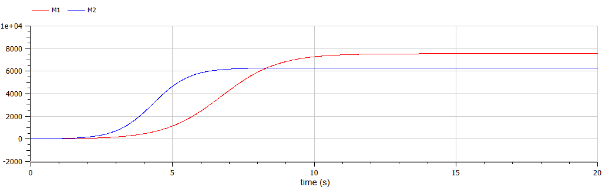
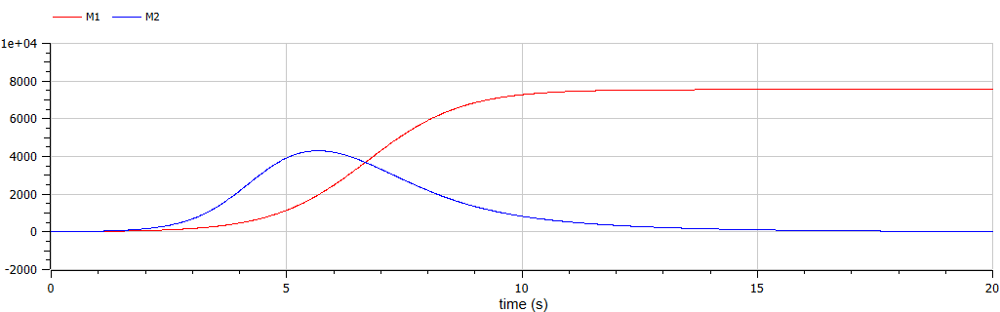

---
## Front matter
lang: ru-RU
title: "Лабораторная работа №8"
subtitle: "Модель конкуренции двух фирм"
author:
    Лилия М. Пономарёва
    НПИбд-02-19\inst{1}
institute: |
	\inst{1}RUDN University, Moscow, Russian Federation
date: 2022, 2 April, Moscow, Russian Federation  

## Formatting
mainfont: PT Serif
romanfont: PT Serif
sansfont: PT Sans
monofont: PT Mono
toc: false
slide_level: 2
theme: metropolis
header-includes: 
 - \metroset{progressbar=frametitle,sectionpage=progressbar,numbering=fraction}
 - '\makeatletter'
 - '\beamer@ignorenonframefalse'
 - '\makeatother'
 - \usepackage[T2A]{fontenc}
 - \usepackage{amsmath}
aspectratio: 43
section-titles: true
---

# Цель работы
Рассмотреть модель конкуренции двух фирм.

# Задание
[Вариант 44]  
Построить графики изменения оборотных средств двух фирм без
учета постоянных издержек и с веденной нормировкой для случаев 1 и 2.  
**Случай 1.** Рассмотрим две фирмы, производящие взаимозаменяемые товары
одинакового качества и находящиеся в одной рыночной нише. Считаем, что в рамках нашей модели конкурентная борьба ведётся только рыночными методами. То есть, конкуренты могут влиять на противника путем изменения параметров своего производства: себестоимость, время цикла, но не могут прямо вмешиваться в ситуацию на рынке. Будем считать, что постоянные издержки пренебрежимо малы, и в модели учитывать не будем.

# Случай 1
В этом случае динамика изменения объемов продаж фирмы 1 и фирмы 2 описывается следующей системой уравнений:
$$ \begin{cases} \frac{\partial M_1}{\partial \theta} = M_1 - \frac{b}{c_1} M_1 M_2 - \frac{a_1}{c_1} M_1^2 \\ \frac{\partial M_2}{\partial \theta} = \frac{c_2}{c_1} M_2 -\frac{b}{c_1} M_1 M_2 - \frac{a_2}{c_1} M_2^2 \end{cases}, $$
где $a_1 = \frac{p_{cr}}{\tau_1^2 \tilde{p}_1^2 Nq}, a_2 = \frac{p_{cr}}{\tau_2^2 \tilde{p}_2^2 Nq}, b = \frac{p_{cr}}{\tau_1^2 \tilde{p}_1^2 \tau_2^2 \tilde{p}_2^2 Nq}, c_1 = \frac{p_{cr} - \tilde{p}_1}{\tau_1 \tilde{p}_1}, c_2 = \frac{p_{cr} - \tilde{p}_2}{\tau_2 \tilde{p}_2}$.  

# Случай 2
Рассмотрим модель, когда, помимо экономического фактора
влияния, используются еще и социально-психологические факторы –
формирование общественного предпочтения одного товара другому, не зависимо от их качества и цены. В этом случае взаимодействие двух фирм будет зависеть друг от друга, соответственно коэффициент перед $M_1M_2$ будет отличаться. Пусть в рамках рассматриваемой модели динамика изменения объемов продаж фирмы 1 и фирмы 2 описывается следующей системой уравнений:
$$ \begin{cases} \frac{\partial M_1}{\partial \theta} = M_1 - \frac{b}{c_1} M_1 M_2 - \frac{a_1}{c_1} M_1^2 \\ \frac{\partial M_2}{\partial \theta} = \frac{c_2}{c_1} M_2 - (\frac{b}{c_1} + 0.00025) M_1 M_2 - \frac{a_2}{c_1} M_2^2 \end{cases} $$

# Начальные условия
Для обоих случаев рассмотрим задачу со следующими начальными условиями и
параметрами: 
\begin{align} 
M_0^1 = 9.1, M_0^2 = 7.7, \nonumber \\ 
p_{cr} = 35, N = 44, q = 1, \nonumber \\ 
\tau_1 = 21, \tau_2 = 20, \nonumber \\ 
\tilde{p}_1 = 13, \tilde{p}_2 = 10. \nonumber
\end{align}

# Код программы
Начальные значения
```
  parameter Real p_cr = 35;
  parameter Real N = 44;
  parameter Real q = 1;
  parameter Real t1 = 21;
  parameter Real t2 = 20;
  parameter Real p1 = 13;
  parameter Real p2 = 10;

  Real M1(start = 9.1);
  Real M2(start = 7.7);
```
# Код программы
Случай 1
```
  parameter Real a1 = p_cr/(t1^2 * p1^2*N*q);
  parameter Real a2 = p_cr/(t2^2 * p2^2 * N*q);
  parameter Real b = p_cr/(t1^2*p1^2 * t2^2*p2^2 * N*q);
  parameter Real c1 = (p_cr - p1)/(t1 * p1);
  parameter Real c2 = (p_cr - p2)/(t2 * p2);
  equation
    der(M1) = M1 - b/c1 * M1 * M2 - a1/c1 * M1^2;
    der(M2) = c2/c1 * M2 - b/c1 * M1 * M2 - a2/c1 * M2^2;
```
# Код программы
Случай 2
```
  parameter Real a1 = p_cr/(t1^2 * p1^2*N*q);
  parameter Real a2 = p_cr/(t2^2 * p2^2 * N*q);
  parameter Real b = p_cr/(t1^2*p1^2 * t2^2*p2^2 * N*q);
  parameter Real c1 = (p_cr - p1)/(t1 * p1);
  parameter Real c2 = (p_cr - p2)/(t2 * p2);
  equation
    der(M1) = M1 - b/c1 * M1 * M2 - a1/c1 * M1^2;
    der(M2) = c2/c1 * M2 - (b/c1 + 0.00025) * M1 * M2 - a2/c1 * M2^2;
```
# Результат работы программы 
{#fig:fig1 width=90%}  

# Результат работы программы 
{ #fig:fig2 width=90% }   

# Вывод
Рассмотрели модель конкуренции двух фирм в двух случаях: без учета социально-психологического фактора и с ним.  

# Список литературы {.unnumbered}
1. [Родионов, Ю.В. Основы математического моделирования: учебное электронное издание / Ю.В. Родионов, А.Д. Нахман ; Тамбовский государственный технический университет. – Тамбов : Тамбовский государственный технический университет (ТГТУ), 2018. – 111 с.](https://biblioclub.ru/index.php?page=book&id=570456. – Библиогр. в кн. – ISBN 978-5-8265-1886-1).
2. [Документация по системе Modelica](https://www.modelica.org/).