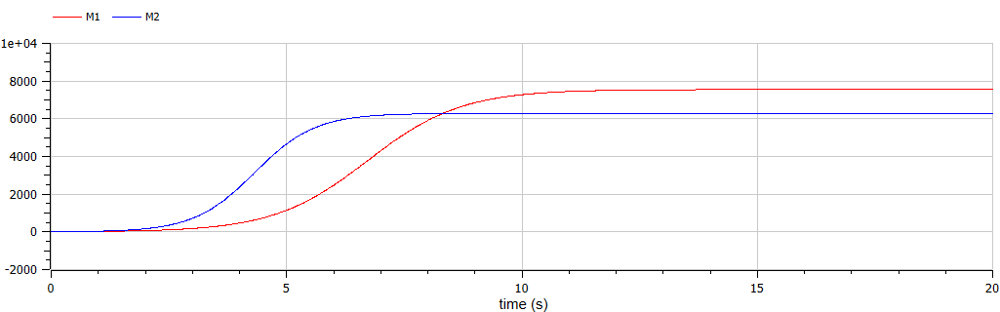
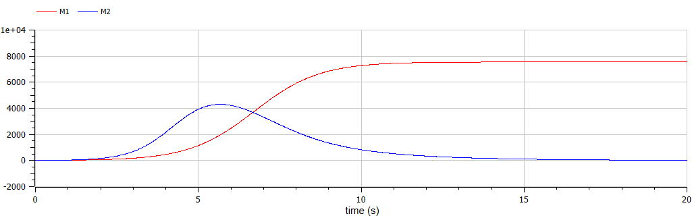

---
# Front matter
lang: ru-RU
title: "Отчет по лабораторной работе №8"
subtitle: "Модель конкуренции двух фирм - вариант 44"
author: "Пономарева Лилия НПИбд-02-19"


# Generic otions
lang: ru-RU
toc-title: "Содержание"

# Bibliography
bibliography: bib/cite.bib
csl: pandoc/csl/gost-r-7-0-5-2008-numeric.csl

# Formatting
toc-title: "Содержание"
toc: true # Table of contents
toc_depth: 2
lof: true # List of figures
fontsize: 12pt
linestretch: 1.5
papersize: a4paper
documentclass: scrreprt
polyglossia-lang: russian
polyglossia-otherlangs: english
mainfont: PT Serif
romanfont: PT Serif
sansfont: PT Sans
monofont: PT Mono
mainfontoptions: Ligatures=TeX
romanfontoptions: Ligatures=TeX
sansfontoptions: Ligatures=TeX,Scale=MatchLowercase
monofontoptions: Scale=MatchLowercase
## Biblatex
biblatex: true
biblio-style: "gost-numeric"
biblatexoptions:
  - parentracker=true
  - backend=biber
  - hyperref=auto
  - language=auto
  - autolang=other*
  - citestyle=gost-numeric
indent: true
pdf-engine: xelatex
header-includes:
  - \linepenalty=10 # the penalty added to the badness of each line within a paragraph (no associated penalty node) Increasing the υalue makes tex try to haυe fewer lines in the paragraph.
  - \interlinepenalty=0 # υalue of the penalty (node) added after each line of a paragraph.
  - \hyphenpenalty=50 # the penalty for line breaking at an automatically inserted hyphen
  - \exhyphenpenalty=50 # the penalty for line breaking at an explicit hyphen
  - \binoppenalty=700 # the penalty for breaking a line at a binary operator
  - \relpenalty=500 # the penalty for breaking a line at a relation
  - \clubpenalty=150 # extra penalty for breaking after first line of a paragraph
  - \widowpenalty=150 # extra penalty for breaking before last line of a paragraph
  - \displaywidowpenalty=50 # extra penalty for breaking before last line before a display math
  - \brokenpenalty=100 # extra penalty for page breaking after a hyphenated line
  - \predisplaypenalty=10000 # penalty for breaking before a display
  - \postdisplaypenalty=0 # penalty for breaking after a display
  - \floatingpenalty = 20000 # penalty for splitting an insertion (can only be split footnote in standard LaTeX)
  - \raggedbottom # or \flushbottom
  - \usepackage{float} # keep figures where there are in the text
  - \floatplacement{figure}{H} # keep figures where there are in the text
---

# Цель работы
Рассмотреть модель конкуренции двух фирм.

## Объект исследования
Модель конкуренции двух фирм.

## Предмет исследования
Уравнение динамики оборотных средств двух конкурирующих фирм.

# Теоретические сведения
### Модель одной фирмы

Для построения модели конкуренции хотя бы двух фирм необходимо рассмотреть модель одной фирмы. Вначале рассмотрим модель фирмы,производящей продукт долговременного пользования, когда цена его определяется балансом спроса и предложения. Примем, что этот продукт занимает определенную нишу рынка и конкуренты в ней отсутствуют.[[1]](#список-литературы)

Обозначим:

$N$ – число потребителей производимого продукта.

$S$ – доходы потребителей данного продукта. Считаем, что доходы всех потребителей одинаковы. Это предположение справедливо, если речь идет об одной рыночной нише, т.е. производимый продукт ориентирован на определенный слой населения.

$M$ – оборотные средства предприятия

$\tau$ – длительность производственного цикла

$p$ – рыночная цена товара

$\tilde{p}$ – себестоимость продукта, то есть переменные издержки на производство единицы продукции.

$\delta$ – доля оборотных средств, идущая на покрытие переменных издержек.

$\kappa$ – постоянные издержки, которые не зависят от количества выпускаемой
продукции.

$Q(S/p)$ – функция спроса, зависящая от отношения дохода S к цене p. Она
равна количеству продукта, потребляемого одним потребителем в единицу
времени.

Функцию спроса товаров долговременного использования часто
представляют в простейшей форме:

$$\tag{1} Q = q - k \frac{P}{S} = q(1 - \frac{p}{p_{cr}})$$

где $q$ – максимальная потребность одного человека в продукте в единицу времени. Эта функция падает с ростом цены и при $p = p_{cr}$ (критическая стоимость продукта) потребители отказываются от приобретения товара. Величина $p_{cr} = Sq/k$. Параметр $k$ – мера эластичности функции спроса по цене. Таким образом, функция спроса в форме (1) является пороговой (то есть, $Q(S/p) = 0$ при $p \geq p_{cr}$) и обладает свойствами насыщения.

Уравнения динамики оборотных средств можно записать в виде

$$ \tag{2} \frac{\partial M}{\partial t} = -\frac{M \delta}{\tau} + NQp - \kappa = -\frac{M \delta}{\tau} + Nq(1 - \frac{p}{p_{cr}})p - \kappa $$

Уравнение для рыночной цены p представим в виде

$$ \tag{3} \frac{\partial p}{\partial t} = \gamma (-\frac{M \delta}{\tau \tilde{p}} + Nq(1 - \frac{p}{p_{cr}}) $$

Первый член соответствует количеству поставляемого на рынок товара (то есть, предложению), а второй член – спросу.

Параметр $\gamma$ зависит от скорости оборота товаров на рынке. Как правило, время торгового оборота существенно меньше времени производственного цикла $\tau$. При заданном $M$ уравнение (3) описывает быстрое стремление цены к равновесному значению цены, которое устойчиво.

В этом случае уравнение (3) можно заменить алгебраическим соотношением

$$ \tag{4} -\frac{M \delta}{\tau \tilde{p}} + Nq(1 - \frac{p}{p_{cr}}) = 0 $$

Из (4) следует, что равновесное значение цены p равно

$$ \tag{5} p = p_{cr}(1 - \frac{M \delta}{\tau \tilde{p} Nq}) $$

Уравнение (2) с учетом (5) приобретает вид

$$ \tag{6} \frac{\partial M}{\partial t} = M \frac{\delta}{\tau}(\frac{p_{cr}}{\tilde{p}} - 1) - M^2 (\frac{\delta}{\tau \delta{p}})^2 \frac{p_{cr}}{Nq} - \kappa $$

Уравнение (6) имеет два стационарных решения, соответствующих условию $\partial M / \partial t$ = 0:

$$ \tag{7} \tilde{M}_{1,2} = \frac{1}{2}a \pm \sqrt{\frac{a^2}{4} - b}$$

где

$$ \tag{8} a = Nq(1 - \frac{\tilde{p}}{p_{cr}}) \tilde{p} \frac{\tau}{\delta}, b = \kappa Nq \frac{(\tau \tilde{p})^2}{p_{cr} \delta^2} $$

Из (7) следует, что при больших постоянных издержках (в случае $a^2 < 4b$) стационарных состояний нет. Это означает, что в этих условиях фирма не может функционировать стабильно, то есть, терпит банкротство. Однако, как правило, постоянные затраты малы по сравнению с переменными (то есть, $b \ll a^2$) и играют роль, только в случае, когда оборотные средства малы. При $b \ll a$ стационарные значения M равны

$$ \tag{9} \tilde{M}_+ = Nq \frac{\tau}{\delta}(1 - \frac{\tilde{p}}{p_{cr}}) \tilde{p}, \tilde{M}_- = \kappa \tilde{p} \frac{\tau}{\delta(p_{cr} - \tilde{p})}$$

Первое состояние $\tilde{M}_+$ устойчиво и соответствует стабильному функционированию предприятия. Второе состояние $\tilde{M}_-$ неустойчиво, так что при $M < \tilde{M}_-$ оборотные средства падают ($\partial M / \partial t < 0$), то есть, фирма идет к банкротству. По смыслу $\tilde{M}_-$ соответствует начальному капиталу, необходимому для входа в рынок.

В обсуждаемой модели параметр $\delta$ всюду входит в сочетании с $\tau$. Это значит, что уменьшение доли оборотных средств, вкладываемых в производство, эквивалентно удлинению производственного цикла. Поэтому мы в дальнейшем положим: $\delta$ = 1, а параметр $\tau$ будем считать временем цикла, с учётом сказанного.

### Конкуренция двух фирм
Рассмотрим две фирмы, производящие взаимозаменяемые товары одинакового качества и находящиеся в одной рыночной нише. Последнее означает, что у потребителей в этой нише нет априорных предпочтений, и они приобретут тот или иной товар, не обращая внимания на знак фирмы.

В этом случае, на рынке устанавливается единая цена, которая определяется балансом суммарного предложения и спроса. Иными словами, в рамках нашей модели конкурентная борьба ведётся только рыночными методами. То есть, конкуренты могут влиять на противника путем изменения параметров своего производства: себестоимость, время цикла, но не могут прямо вмешиваться в ситуацию на рынке («назначать» цену или влиять на потребителей каким-либо иным способом.)

Уравнения динамики оборотных средств запишем по аналогии с (2) в виде

$$ \tag{10} \begin{cases} \frac{\partial M_1}{\partial t} = - \frac{M_1}{\tau_1} + N_1q(1 - \frac{p}{p_{cr}})p - \kappa_1 \\ \frac{\partial M_2}{\partial t} = - \frac{M_2}{\tau_2} + N_2q(1 - \frac{p}{p_{cr}})p - \kappa_2 \end{cases} $$

где использованы те же обозначения, а индексы 1 и 2 относятся к первой и второй фирме, соответственно. Величины $N_1$ и $N_2$ – числа потребителей, приобретших товар первой и второй фирмы.

Учтем, что товарный баланс устанавливается быстро, то есть, произведенный каждой фирмой товар не накапливается, а реализуется по цене $p$. Тогда

$$ \tag{11} \begin{cases} \frac{M_1}{\tau_1 \tilde{p}_1} = - N_1q(1 - \frac{p}{p_{cr}}) \\ \frac{M_2}{\tau_2 \tilde{p}_2} = - N_2q(1 - \frac{p}{p_{cr}}) \end{cases} $$

где $\tilde{p}_1$ и $\tilde{p}_2$ – себестоимости товаров в первой и второй фирме.

С учетом (10) представим (11) в виде

$$ \tag{12} \begin{cases} \frac{\partial M_1}{\partial t} = - \frac{M_1}{\tau_1}(1 - \frac{p}{\tilde{p}_1}) - \kappa_1 \\ \frac{\partial M_2}{\partial t} = - \frac{M_2}{\tau_2}(1 - \frac{p}{\tilde{p}_2}) - \kappa_2 \end{cases} $$

Уравнение для цены, по аналогии с (3),

$$ \tag{13} \frac{\partial p}{\partial t} = - \gamma (\frac{M_1}{\tau_1 \tilde{p}_1} + \frac{M_2}{\tau_2 \tilde{p}_2} - Nq(1 - \frac{p}{p_{cr}}) $$

Считая, как и выше, что ценовое равновесие устанавливается быстро, получим:

$$ \tag{14} p = p_{cr} (1 - \frac{1}{Nq} (\frac{M_1}{\tau_1 \tilde{p}_1} + \frac{M_2}{\tau_2 \tilde{p}_2})) $$

Подставив (14) в (12) имеем:

$$ \tag{15} \begin{cases} \frac{\partial M_1}{\partial t} = c_1 M_1 - b M_1 M_2 - a_1 M_1^2 - \kappa_1 \\ \frac{\partial M_2}{\partial t} = c_2 M_2 - b M_1 M_2 - a_2 M_2^2 - \kappa_2 \end{cases} $$

где

$$ \tag{16} a_1 = \frac{p_{cr}}{\tau_1^2 \tilde{p}_1^2 Nq}, a_2 = \frac{p_{cr}}{\tau_2^2 \tilde{p}_2^2 Nq}, b = \frac{p_{cr}}{\tau_1^2 \tilde{p}_1^2 \tau_2^2 \tilde{p}_2^2 Nq}, c_1 = \frac{p_{cr} - \tilde{p}_1}{\tau_1^2 \tilde{p}_1^2}, c_2 = \frac{p_{cr} - \tilde{p}_2}{\tau_2^2 \tilde{p}_2^2} $$

Исследуем систему (15) в случае, когда постоянные издержки ($κ_1, κ_2$) пренебрежимо малы. И введем нормировку $t = c_1 \theta$. Получим следующую систему:

$$ \tag{17} \begin{cases} \frac{\partial M_1}{\partial \theta} = M_1 - \frac{b}{c_1} M_1 M_2 - \frac{a_1}{c_1} M_1^2 \\ \frac{\partial M_2}{\partial \theta} = \frac{c_2}{c_1} M_2 -\frac{b}{c_1} M_1 M_2 - \frac{a_2}{c_1} M_2^2 \end{cases} $$

# Выполнение лабораторной работы
## Задание
**Вариант 44**  
**Случай 1.** Рассмотрим две фирмы, производящие взаимозаменяемые товары
одинакового качества и находящиеся в одной рыночной нише. Считаем, что в рамках нашей модели конкурентная борьба ведётся только рыночными методами. То есть, конкуренты могут влиять на противника путем изменения параметров своего производства: себестоимость, время цикла, но не могут прямо вмешиваться в ситуацию на рынке («назначать» цену или влиять на потребителей каким-либо иным способом.) Будем считать, что постоянные издержки пренебрежимо малы, и в модели учитывать не будем. В этом случае динамика изменения объемов продаж фирмы 1 и фирмы 2 описывается следующей системой уравнений:
$$ \begin{cases} \frac{\partial M_1}{\partial \theta} = M_1 - \frac{b}{c_1} M_1 M_2 - \frac{a_1}{c_1} M_1^2 \\ \frac{\partial M_2}{\partial \theta} = \frac{c_2}{c_1} M_2 -\frac{b}{c_1} M_1 M_2 - \frac{a_2}{c_1} M_2^2 \end{cases}, $$
где $a_1 = \frac{p_{cr}}{\tau_1^2 \tilde{p}_1^2 Nq}, a_2 = \frac{p_{cr}}{\tau_2^2 \tilde{p}_2^2 Nq}, b = \frac{p_{cr}}{\tau_1^2 \tilde{p}_1^2 \tau_2^2 \tilde{p}_2^2 Nq}, c_1 = \frac{p_{cr} - \tilde{p}_1}{\tau_1 \tilde{p}_1}, c_2 = \frac{p_{cr} - \tilde{p}_2}{\tau_2 \tilde{p}_2}$.
Также введена нормировка $t = c_1 \theta$.

**Случай 2.** Рассмотрим модель, когда, помимо экономического фактора
влияния (изменение себестоимости, производственного цикла, использование
кредита и т.п.), используются еще и социально-психологические факторы –
формирование общественного предпочтения одного товара другому, не зависимо от их качества и цены. В этом случае взаимодействие двух фирм будет зависеть друг от друга, соответственно коэффициент перед $M_1M_2$ будет отличаться. Пусть в рамках рассматриваемой модели динамика изменения объемов продаж фирмы 1 и фирмы 2 описывается следующей системой уравнений:

$$ \begin{cases} \frac{\partial M_1}{\partial \theta} = M_1 - \frac{b}{c_1} M_1 M_2 - \frac{a_1}{c_1} M_1^2 \\ \frac{\partial M_2}{\partial \theta} = \frac{c_2}{c_1} M_2 - (\frac{b}{c_1} + 0.00025) M_1 M_2 - \frac{a_2}{c_1} M_2^2 \end{cases} $$

Для обоих случаев рассмотрим задачу со следующими начальными условиями и
параметрами: 
\begin{align} 
M_0^1 = 9.1, M_0^2 = 7.7, \nonumber \\ 
p_{cr} = 35, N = 44, q = 1, \nonumber \\ 
\tau_1 = 21, \tau_2 = 20, \nonumber \\ 
\tilde{p}_1 = 13, \tilde{p}_2 = 10. \nonumber
\end{align}

1. Построить графики изменения оборотных средств фирмы 1 и фирмы 2 без
учета постоянных издержек и с веденной нормировкой для случая 1.
2. Построить графики изменения оборотных средств фирмы 1 и фирмы 2 без
учета постоянных издержек и с веденной нормировкой для случая 2.

## Случай первый
Написали программу, моделирующую динамику изменения объемов продаж фирмы 1 и 2 (конкурентная борьба ведётся только рыночными методами) на языке Modelica.[[2]](#список-литературы)
```
model lab08
  parameter Real a1 = p_cr/(t1^2 * p1^2*N*q);
  parameter Real a2 = p_cr/(t2^2 * p2^2 * N*q);
  parameter Real b = p_cr/(t1^2*p1^2 * t2^2*p2^2 * N*q);
  parameter Real c1 = (p_cr - p1)/(t1 * p1);
  parameter Real c2 = (p_cr - p2)/(t2 * p2);
  
  parameter Real p_cr = 35;
  parameter Real N = 44;
  parameter Real q = 1;
  parameter Real t1 = 21;
  parameter Real t2 = 20;
  parameter Real p1 = 13;
  parameter Real p2 = 10;
  
  Real M1(start = 9.1);
  Real M2(start = 7.7);
  
  equation
    der(M1) = M1 - b/c1 * M1 * M2 - a1/c1 * M1^2;
    der(M2) = c2/c1 * M2 - b/c1 * M1 * M2 - a2/c1 * M2^2;
    
end lab08;
```
Получили график изменения объемов продаж фирм (см. [@fig:fig1]).

{#fig:fig1 width=90%}  

## Случай второй
Написали программу, моделирующую динамику изменения объемов продаж фирмы 1 и 2 (с учетом социально-психологических факторов) на языке Modelica.[[2]](#список-литературы)
```
model lab08_2
  parameter Real a1 = p_cr/(t1^2 * p1^2*N*q);
  parameter Real a2 = p_cr/(t2^2 * p2^2 * N*q);
  parameter Real b = p_cr/(t1^2*p1^2 * t2^2*p2^2 * N*q);
  parameter Real c1 = (p_cr - p1)/(t1 * p1);
  parameter Real c2 = (p_cr - p2)/(t2 * p2);
  
  parameter Real p_cr = 35;
  parameter Real N = 44;
  parameter Real q = 1;
  parameter Real t1 = 21;
  parameter Real t2 = 20;
  parameter Real p1 = 13;
  parameter Real p2 = 10;
  
  Real M1(start = 9.1);
  Real M2(start = 7.7);
  
  equation
    der(M1) = M1 - b/c1 * M1 * M2 - a1/c1 * M1^2;
    der(M2) = c2/c1 * M2 - (b/c1 + 0.00025) * M1 * M2 - a2/c1 * M2^2;

end lab08_2;
```
Получили график изменения объемов продаж фирм (см. [@fig:fig2]).

{ #fig:fig2 width=90% }  

# Выводы

Рассмотрели модель конкуренции двух фирм в двух случаях: без учета социально-психологического фактора и с ним.  
В первом случае (см. [@fig:fig1]) можем заметить, что рост оборотных средств предприятий идет независимо друг от друга. Каждая фирма достигает свое максимальное значение объема продаж и остается на рынке с этим значением, то есть каждая фирма захватывает свою часть рынка потребителей, которая не изменяется. Для первой фирмы это значение состовляет 7550.24 млн. единиц, для второй - 6285.61 млн. единиц.  
Во втором случае (см. [@fig:fig2]) можем заметить, что вторая фирма, несмотря на начальный рост, начитает нести убытки и, в итоге, терпит банкротство. Динамика роста объёмов оборотных средств второй фирмы остается без изменения: достигнув максимального значения, остаётся на этом уровне.


# Список литературы {.unnumbered}

1. [Родионов, Ю.В. Основы математического моделирования: учебное электронное издание / Ю.В. Родионов, А.Д. Нахман ; Тамбовский государственный технический университет. – Тамбов : Тамбовский государственный технический университет (ТГТУ), 2018. – 111 с.](https://biblioclub.ru/index.php?page=book&id=570456. – Библиогр. в кн. – ISBN 978-5-8265-1886-1).
2. [Документация по системе Modelica](https://www.modelica.org/).